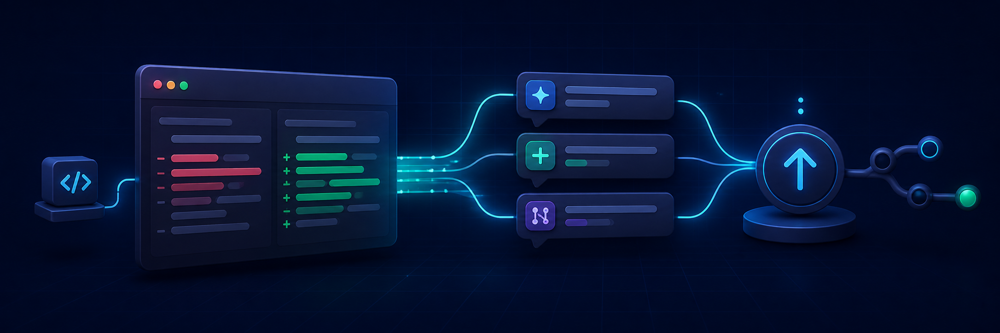

# What Did I Do?



> Turn Git changes into a short, accurate explanation before a push or whenever
> you ask.

`what-did-i-do` is a portable Agent Skill for Codex, Claude Code, Gemini CLI,
and other clients that support the
[Agent Skills specification](https://agentskills.io/specification).

It collects bounded Git evidence, makes the agent inspect the relevant diff,
and produces one to three outcome-focused bullets. Pushed commits and
uncommitted local work are always kept separate.

## What it does

- Summarizes code changes in plain language instead of listing every edited file.
- Uses the actual Git diff before making behavioral claims.
- Detects working-tree changes, outgoing commits, or the latest commit.
- Reports validations only when they were actually run.
- Never pushes merely because you requested a summary.

## Install

Clone the repository into the skill directory used by your coding agent.

### Codex and Agent Skills clients

```bash
git clone https://github.com/Noverse0/what-did-i-do.git \
  ~/.agents/skills/what-did-i-do
```

OMX installations that use the Codex-specific skill root can install it with:

```bash
git clone https://github.com/Noverse0/what-did-i-do.git \
  ~/.codex/skills/what-did-i-do
```

### Claude Code

```bash
git clone https://github.com/Noverse0/what-did-i-do.git \
  ~/.claude/skills/what-did-i-do
```

### Gemini CLI

```bash
git clone https://github.com/Noverse0/what-did-i-do.git \
  ~/.gemini/skills/what-did-i-do
```

For project-only installation, replace the user-level prefix with
`.agents/skills`, `.claude/skills`, or `.gemini/skills` inside the repository.

## Use

Ask naturally after making changes:

```text
What did I change? Keep it short.
Push this and explain what was pushed in three bullets.
변경사항을 짧게 요약해줘.
수정한 내용을 push하고 무엇이 바뀌었는지 알려줘.
```

Explicit invocation is also available where the client supports it:

```text
$what-did-i-do Summarize my current changes.
/what-did-i-do
```

Example output:

```text
변경 요약
- 이름 입력의 앞뒤 공백을 제거하고 빈 값은 오류로 처리합니다.
- 정상 입력과 빈 입력을 검증하는 테스트를 추가했습니다.
- 검증: 테스트 2개 통과.
```

## How it works

The bundled collector chooses a Git scope, then the skill requires the agent
to inspect the corresponding diff before writing the summary.

| Mode | Summary scope |
| --- | --- |
| `auto` | Working tree first, then outgoing commits, then the latest commit |
| `working` | Staged, unstaged, and untracked changes |
| `outgoing` | Commits ahead of the configured upstream branch |
| `last` | The most recent commit |

Run the evidence collector directly when debugging or adapting the skill:

```bash
python3 scripts/collect_change_context.py --mode auto
```

The collector outputs filenames, stats, commit subjects, branch information,
and upstream state. It intentionally does not replace semantic diff inspection.

## Push safety

When you explicitly request a push, the skill summarizes only the commits in
the outgoing range immediately before pushing. Staged, unstaged, and untracked
files are never described as pushed.

A summary request by itself does not authorize a commit or push. A push run
directly in a separate terminal is also outside the skill's lifecycle; use a
Git hook if you need terminal-level automation.

## Requirements

- Git
- Python 3.10 or newer
- A coding agent with Agent Skills support

No third-party Python packages are required.

## Structure

```text
what-did-i-do/
├── SKILL.md
├── agents/
│   └── openai.yaml
├── assets/
│   └── what-did-i-do-hero.png
├── references/
│   └── compatibility.md
└── scripts/
    └── collect_change_context.py
```

See [agent compatibility](references/compatibility.md) for platform-specific
discovery and invocation details.
